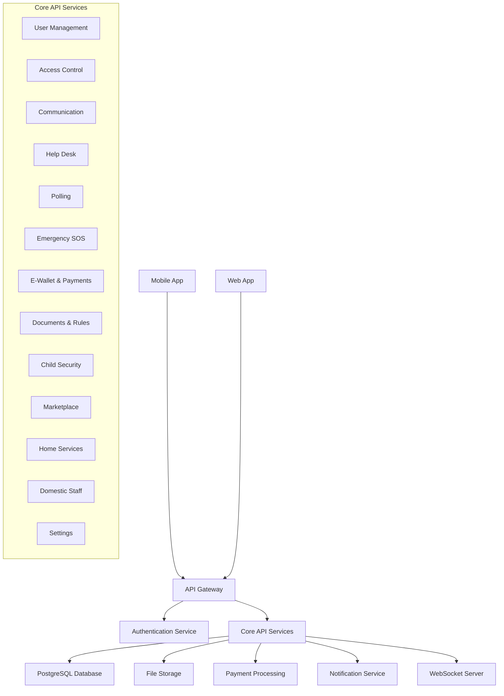

# Design Document

## Overview

ClustR is a comprehensive estate management system designed to streamline and enhance the living experience in residential estates. The platform provides a unified solution for estate administrators and residents to manage various aspects of estate living, including access control, communication, payments, security, and community engagement.

This design document outlines the architecture, components, interfaces, data models, and other technical aspects of the ClustR application based on the requirements specified in the requirements document.

## Architecture

### System Architecture

ClustR follows a modern, scalable architecture with the following key components:

1. **Backend API Server**: A Django-based RESTful API server that handles all business logic, data processing, and serves as the central hub for all client interactions. The project is organized into several Django apps:
   - `accounts`: Handles user authentication, permissions, and profile management
   - `core`: Contains common utilities, models, and shared functionality that both management and members apps need to access
   - `members`: Manages estate residents, their relationships, and resident-focused features
   - `management`: Handles estate management functionality and administrative features

   The separation between `members` and `management` apps follows these principles:
   - **Management App**: Handles administrative functions, estate-wide operations, and services that affect multiple users or the estate as a whole
   - **Members App**: Focuses on individual resident services, personal information, and features used by residents
   - **Core App**: Contains shared models, utilities, and functionality used by both apps

2. **Frontend Clients**:
   - Mobile Application: Native mobile apps for iOS and Android platforms
   - Web Application: A responsive web interface for administrators and residents

3. **Database**: Currently using PostgreSQL

4. **Authentication Service**: Custom authentication system using Django's AbstractUser with email-based authentication and verification.

5. **File Storage**: Cloud-based storage for documents, images, and other media files.

6. **Payment Processing**: Integration with payment processors (Paystack, Flutterwave) for handling financial transactions.

7. **Notification Service**: Email-based notification system with support for different notification types.

7. **Notification Service**: Real-time notification system for alerts, announcements, and updates.

3. **Database**: PostgreSQL database for persistent storage of all application data.


8. **Permission System**: Role-based access control system with predefined permissions for different user types.

7. **Notification Service**: Real-time notification system for alerts, announcements, and updates.

8. **WebSocket Server**: For real-time communication features like chat and SOS alerts.


### High-Level Architecture Diagram



## Components and Interfaces

### Backend Components Organization

The backend components are organized across the different Django apps based on their functionality and target users:

1. **Core App Components**:
   - Shared models and base classes
   - Common utilities and middleware
   - Estate-based filtering and multi-tenant support
   - File storage and media handling
   - Error handling and logging

2. **Accounts App Components**:
   - User authentication and registration
   - Permission management
   - Profile management
   - Email and phone verification

3. **Management App Components**:
   - Estate administration
   - User management (admin perspective)
   - Estate-wide announcements
   - Help desk administration
   - Poll creation and management
   - Service provider directory management
   - Rule book and documentation management

4. **Members App Components**:
   - Resident-specific features
   - Personal profile management
   - Individual payment processing
   - Child security management
   - Marketplace interactions
   - Emergency contact management

### Backend Components

#### 1. User Management Module

Responsible for user registration, authentication, profile management, and permissions.

**Key Interfaces**:
- `/auth/register` - User registration endpoint (accounts app)
- `/auth/login` - User authentication endpoint (accounts app)
- `/users` - User management endpoints (management app)
- `/users/{userId}/profile` - User profile management (accounts app)
- `/user/profile` - Personal profile management (members app)

#### 2. Access Control Module

Manages visitor access, event invitations, and entry/exit tracking.

**Key Interfaces**:
- `/visitors` - Visitor management endpoints
- `/visitors/{id}/access-code` - Access code generation
- `/events` - Event management endpoints
- `/visit-requests` - Visit request management

#### 3. Communication Module

Handles announcements, chat functionality, and group communications.

**Key Interfaces**:
- `/announcements` - Announcement management endpoints
- `/announcements/{announcementId}/comments` - Comment management
- `/chats` - Chat management endpoints
- `/chats/{chatId}/messages` - Message management
- `/groups` - Group management endpoints

#### 4. Help Desk Module

Manages complaint submission, tracking, and resolution.

**Key Interfaces**:
- `/helpdesk/issues` - Issue management endpoints
- `/helpdesk/issues/{issueId}` - Issue detail management
- `/helpdesk/issues/{issueId}/messages` - Issue message management

#### 5. Polling Module

Handles creation and management of polls and community feedback.

**Key Interfaces**:
- `/polls` - Poll management endpoints
- `/polls/{id}/vote` - Poll voting endpoint
- `/polls/{pollId}/responses` - Poll response management

#### 6. Emergency SOS Module

Manages emergency alerts and emergency contact information.

**Key Interfaces**:
- `/sos-alert` - SOS alert management
- `/emergency-contacts` - Emergency contact management
- `/emergency-numbers` - Emergency number management

#### 7. E-Wallet and Payment Module

Handles financial transactions, wallet management, and payment processing.

**Key Interfaces**:
- `/wallet` - Wallet management endpoint
- `/transactions` - Transaction management
- `/payments` - Payment management endpoints
- `/payments/{paymentId}/proceed` - Payment processing
- `/payments/{paymentId}/schedule` - Payment scheduling
- `/payments/electricity` - Utility bill payment

#### 8. Document Management Module

Manages estate rules, guidelines, and document storage.

**Key Interfaces**:
- `/documents/upload-mobile` - Document upload endpoint

#### 9. Child Security Module

Manages child registration, exit requests, and movement tracking.

**Key Interfaces**:
- `/children` - Child management endpoints
- `/children/{childId}` - Child detail management
- `/children/{childId}/entry-exit-log` - Entry/exit log management
- `/approval-requests` - Approval request management

#### 10. Marketplace Module

Handles listing, browsing, and management of marketplace items.

**Key Interfaces**:
- `/marketplace/listings` - Listing management endpoints
- `/marketplace/listings/{listingId}` - Listing detail management
- `/marketplace/listings/my-listings` - User's listings management

#### 11. Home Services Directory Module

Manages service provider listings and bookings.

**Key Interfaces**:
- `/directory` - Directory management endpoint
- `/directory/providers/{providerId}` - Provider detail management

#### 12. Domestic Staff Module

Handles registration and management of domestic staff.

**Key Interfaces**:
- `/domestic-staff` - Staff management endpoints
- `/domestic-staff/{staffId}` - Staff detail management

#### 13. Settings Module

Manages user preferences and application settings.

**Key Interfaces**:
- `/user/profile` - User profile settings
- `/users/{userId}/change-password` - Password management

### Frontend Components

#### Mobile Application

1. **Authentication Screens**:
   - Login
   - Registration
   - Password Reset

2. **Home Screen**:
   - Quick Services Dashboard
   - Notifications Center
   - Recent Activities

3. **Access Control Screens**:
   - Visitor Management
   - Event Creation
   - Access Code Generation
   - Visitor Logs

4. **Communication Screens**:
   - Announcements Feed
   - Chat Interface
   - Group Management

5. **Help Desk Screens**:
   - Issue Reporting
   - Issue Tracking
   - Issue Detail View

6. **Polling Screens**:
   - Active Polls
   - Poll Voting Interface
   - Poll Results

7. **Emergency Screens**:
   - SOS Button
   - Emergency Contact Management
   - Emergency Status Tracking

8. **Financial Screens**:
   - Wallet Dashboard
   - Transaction History
   - Payment Processing
   - Bill Management

9. **Document Screens**:
   - Rule Book View
   - Document Browser
   - Document Upload

10. **Child Security Screens**:
    - Child Management
    - Exit Request Creation
    - Movement Tracking

11. **Marketplace Screens**:
    - Listing Browser
    - Listing Creation
    - Listing Detail View

12. **Home Services Screens**:
    - Service Provider Directory
    - Provider Detail View
    - Booking Interface

13. **Domestic Staff Screens**:
    - Staff Management
    - Staff Detail View

14. **Settings Screens**:
    - Profile Management
    - Notification Settings
    - Security Settings

## Data Models

### Multi-Tenant Architecture

ClustR is designed as a multi-tenant platform where each estate represents a tenant. This architecture requires careful consideration of data isolation and access control:

1. **Estate-Based Data Filtering**:
   - All data is associated with a specific estate
   - Queries must include estate filtering to ensure data isolation
   - API endpoints enforce estate-level access control

2. **Tenant Identification**:
   - Users are associated with one or more estates
   - Authentication tokens include estate context
   - API requests include estate identification

3. **Shared vs. Isolated Data**:
   - Core configuration data may be shared across estates
   - User data, transactions, and estate-specific content is isolated
   - Some reference data may be shared but with estate-specific customizations

### Core Models

#### Estate Model
```python
class Estate:
    id: UUID
    name: str
    address: str
    city: str
    state: str
    country: str
    logo_url: str
    primary_contact_name: str
    primary_contact_email: str
    primary_contact_phone: str
    subscription_status: str  # active, inactive, trial
    subscription_expiry: datetime
    created_at: datetime
    last_modified_at: datetime
```

#### User Model
```python
class User:
    id: UUID
    first_name: str
    last_name: str
    email: str
    phone_number: str
    password_hash: str
    profile_picture_url: str
    permissions: List[Permission]
    estates: List[Estate]  # Users can belong to multiple estates
    primary_estate_id: UUID  # Default estate for the user
    created_at: datetime
    last_modified_at: datetime
```

#### Permission Model
```python
class Permission(Enum):
    ACCESS_CONTROL = "AccessControl"
    PAY_BILLS = "PayBills"
    SNAP_AND_REPORT = "SnapAndReport"
    ANNOUNCEMENT = "Announcement"
    CHAT = "Chat"
    E_WALLET = "E-wallet"
    MARKETPLACE = "MarketPlace"
```

### Access Control Models

#### Visitor Model
```python
class Visitor:
    id: UUID
    name: str
    email: str
    phone: str
    estimated_arrival: datetime
    visit_type: str  # One-time, Short stay, Extended stay
    access_code: str
    invited_by: str
    estate: str
    status: str  # pending, approved, rejected, checked-in, checked-out
    valid_for: str  # One-Time, Multiple visits
    valid_date: date
```

#### Event Model
```python
class Event:
    id: UUID
    title: str
    description: str
    event_date: date
    event_time: time
    guests_added: int
    invited_by: str
    estate: str
    access_code: str
    valid_for: str  # One-Time
```

#### VisitorLog Model
```python
class VisitorLog:
    id: UUID
    visitor_id: UUID
    visitor_name: str
    date: date
    arrival_time: time
    departure_time: time
    status: str  # scheduled, checked-in, checked-out, cancelled
    log_type: str  # recent, scheduled, checked-in
```

### Communication Models

#### Announcement Model
```python
class Announcement:
    id: UUID
    title: str
    content: str
    category: str  # News, Estate Issues, Others
    author_id: UUID
    attachments: List[Attachment]
    created_at: datetime
    last_modified_at: datetime
    comments_count: int
```

#### Comment Model
```python
class Comment:
    id: UUID
    announcement_id: UUID
    author_id: UUID
    content: str
    created_at: datetime
    last_modified_at: datetime
```

#### Chat Model
```python
class Chat:
    id: UUID
    type: str  # individual, group
    group_id: UUID  # nullable
    participants: List[UserSummary]
    last_message: Message
    unread_count: int
    created_at: datetime
    last_modified_at: datetime
```

#### Message Model
```python
class Message:
    id: UUID
    chat_id: UUID
    sender_id: UUID
    content: str
    message_type: str  # text, image, file, system
    attachments: List[Attachment]
    timestamp: datetime
    is_read: bool
```

### Help Desk Models

#### IssueTicket Model
```python
class IssueTicket:
    issue_no: str
    issue_type: str  # Carpentry, Plumbing, Electrical, Cleaning, Security, Other
    description: str
    status: str  # Open, In Progress, Resolved, Closed, Pending, Submitted
    reported_by_user_id: UUID
    reported_date: date
    comments_count: int
    last_updated: datetime
    assignee_id: UUID  # nullable
```

### Polling Models

#### Poll Model
```python
class Poll:
    id: UUID
    question: str
    options: List[PollOption]
    duration: str
    end_time: time
    total_votes: int
    created_by: str
    status: str  # active, ended
```

#### PollOption Model
```python
class PollOption:
    id: UUID
    text: str
    votes: int
    percentage: float
```

### Emergency Models

#### EmergencyContact Model
```python
class EmergencyContact:
    id: UUID
    name: str
    phone_number: str
    emergency_type: str  # theft, health_emergency, domestic_violence, fire, other
    is_active: bool
    created_at: datetime
    last_modified_at: datetime
```

#### SOSRequest Model
```python
class SOSRequest:
    type: str  # THEFT, HEALTH EMERGENCY, DOMESTIC VIOLENCE, OTHERS
    description: str  # optional
```

### Financial Models

#### Wallet Model
```python
class Wallet:
    balance: decimal
    currency: str
    account_number: str
    available_balance: decimal
    last_updated: datetime
```

#### Transaction Model
```python
class Transaction:
    id: UUID
    type: str  # payment, transfer, deposit, withdrawal
    description: str
    amount: decimal
    currency: str
    date: datetime
    status: str  # completed, pending, failed
    reference: str
```

#### Payment Model
```python
class Payment:
    id: UUID
    type: str
    amount: decimal
    currency: str
    status: str  # pending, overdue, due, upcoming, completed
    due_date: date
    provider: str
    description: str
    created_at: datetime
```

### Document Models

#### Document Model
```python
class Document:
    id: UUID
    filename: str
    filesize: str
    file_type: str
    type: str  # payment_receipt, bill, contract, other
    category: str  # personal, work
    description: str
    upload_date: datetime
    download_url: str
```

### Child Security Models

#### Child Model
```python
class Child:
    id: UUID
    name: str
    date_of_birth: date
    gender: str  # male, female
    age: int
    profile_photo: str
    house_number: str
    emergency_contacts: List[EmergencyContact]
    entry_exit_log: List[EntryExitLog]
```

#### EntryExitLog Model
```python
class EntryExitLog:
    id: UUID
    date: date
    exit_time: time
    entry_time: time
    reason: str
    status: str
```

#### ApprovalRequest Model
```python
class ApprovalRequest:
    id: UUID
    requester_id: UUID
    requester_name: str
    child_id: UUID
    description: str
    status: str  # pending, approved, denied
    timestamp: datetime
```

### Marketplace Models

#### MarketplaceListing Model
```python
class MarketplaceListing:
    id: UUID
    title: str
    price: decimal
    currency: str
    seller_id: UUID
    seller_name: str
    category: str
    subcategory: str
    condition: str
    description: str
    images: List[str]
    created_at: datetime
    is_bookmarked: bool
```

### Home Services Models

#### ServiceProvider Model
```python
class ServiceProvider:
    id: UUID
    name: str
    profession: str
    phone_number: str
    address: str
    rating: float
    category: str  # electrician, plumbing, dry_cleaning, gardener, automobile_repair
    profile_picture: str
    is_recently_used: bool
    created_at: datetime
    last_modified_at: datetime
```

### Domestic Staff Models

#### DomesticStaff Model
```python
class DomesticStaff:
    id: UUID
    first_name: str
    last_name: str
    role: str
    profile_picture: str
    user_id: UUID
    created_at: datetime
    last_modified_at: datetime
```

## Error Handling

### Error Response Structure

All API errors will follow a consistent structure:

```json
{
  "error": "ERROR_CODE",
  "message": "Human-readable error message",
  "details": {
    // Optional additional error details
  }
}
```

### Common Error Codes

1. `AUTHENTICATION_ERROR`: Issues with user authentication
2. `AUTHORIZATION_ERROR`: User lacks necessary permissions
3. `VALIDATION_ERROR`: Input validation failures
4. `RESOURCE_NOT_FOUND`: Requested resource does not exist
5. `RESOURCE_CONFLICT`: Resource already exists or conflicts
6. `PAYMENT_ERROR`: Issues with payment processing
7. `EXTERNAL_SERVICE_ERROR`: Issues with third-party services
8. `INTERNAL_SERVER_ERROR`: Unexpected server errors

### Error Handling Strategy

1. **Client-Side Validation**: Implement comprehensive client-side validation to catch common errors before API requests.
2. **API Validation**: Validate all API inputs and return clear validation errors.
3. **Graceful Degradation**: Design the system to continue functioning with reduced capabilities when services fail.
4. **Comprehensive Logging**: Log all errors with context for debugging and monitoring.
5. **User-Friendly Messages**: Translate technical errors into user-friendly messages.

<!-- ## Testing Strategy

### Testing Levels

1. **Unit Testing**:
   - Test individual components and functions in isolation
   - Focus on business logic and utility functions
   - Use pytest for Python backend testing

2. **Integration Testing**:
   - Test interactions between components
   - Focus on API endpoints and database operations
   - Use pytest with database fixtures

3. **End-to-End Testing**:
   - Test complete user flows
   - Focus on critical paths like registration, payments, and access control
   - Use Cypress for web and Detox for mobile testing

4. **Performance Testing**:
   - Test system performance under load
   - Focus on high-traffic endpoints and real-time features
   - Use JMeter or Locust for load testing

### Testing Approach

1. **Test-Driven Development (TDD)**:
   - Write tests before implementing features
   - Ensure all requirements are covered by tests

2. **Continuous Integration**:
   - Run tests automatically on code changes
   - Block merges if tests fail

3. **Regression Testing**:
   - Ensure new changes don't break existing functionality
   - Maintain a comprehensive test suite

4. **Security Testing**:
   - Regular security audits and penetration testing -->
   - Focus on authentication, authorization, and data protection

## Security Considerations

### Authentication and Authorization

1. **JWT Authentication**:
   - Use JWT tokens with RSA encryption for secure authentication
   - Implement token expiration and refresh mechanisms

2. **Role-Based Access Control**:
   - Define clear user roles and permissions
   - Enforce access control at the API level

3. **Multi-Factor Authentication**:
   - Support two-factor authentication for sensitive operations
   - Use SMS or authenticator apps for second factors

### Data Protection

1. **Encryption**:
   - Encrypt sensitive data at rest and in transit
   - Use HTTPS for all API communications

2. **Data Minimization**:
   - Collect and store only necessary data
   - Implement data retention policies

3. **Privacy Controls**:
   - Allow users to control their data sharing preferences
   - Provide mechanisms for data export and deletion

### Secure Development Practices

1. **Input Validation**:
   - Validate all user inputs to prevent injection attacks
   - Use parameterized queries for database operations

2. **Dependency Management**:
   - Regularly update dependencies to address vulnerabilities
   - Use tools like Dependabot for automated updates

3. **Security Headers**:
   - Implement security headers like CSP, HSTS, and X-XSS-Protection
   - Use tools like Helmet.js for consistent header management

## Deployment and DevOps

### Deployment Strategy

1. **Containerization**:
   - Use Docker containers for consistent environments
   - Define services using Docker Compose

2. **Kubernetes Orchestration**:
   - Deploy to AWS Kubernetes cluster for production
   - Use Helm charts for deployment configuration

3. **Environment Management**:
   - Maintain separate development, staging, and production environments
   - Use environment variables for configuration

### CI/CD Pipeline

1. **Continuous Integration**:
   - Automatically build and test code on each commit
   - Use GitHub Actions for CI workflows

2. **Continuous Deployment**:
   - Automatically deploy to staging after successful tests
   - Require manual approval for production deployments

3. **Monitoring and Alerting**:
   - Monitor application health and performance
   - Set up alerts for critical issues

### Scaling Strategy

1. **Horizontal Scaling**:
   - Add more instances to handle increased load
   - Use auto-scaling based on CPU and memory metrics

2. **Database Scaling**:
   - Implement read replicas for improved read performance
   - Consider sharding for very large datasets

3. **Caching Strategy**:
   - Use Redis for caching frequently accessed data
   - Implement CDN for static assets

## Third-Party Integrations

### Payment Processors

1. **Paystack Integration**:
   - Use Paystack API for payment processing
   - Implement webhooks for payment status updates

2. **Flutterwave Integration**:
   - Use Flutterwave API for bill payments
   - Implement secure API key management

### File Storage

1. **Cloud Storage Integration**:
   - Use AWS S3 or similar for file storage
   - Implement secure, time-limited access URLs

### Notification Services

1. **Push Notification Integration**:
   - Use Firebase Cloud Messaging for mobile push notifications
   - Implement notification preferences and opt-out mechanisms

2. **Email Service Integration**:
   - Use SendGrid or similar for transactional emails
   - Implement email templates and tracking

### SMS Services

1. **SMS Gateway Integration**:
   - Use Twilio or similar for SMS notifications
   - Implement rate limiting and cost controls

## Future Considerations

1. **Internationalization**:
   - Support multiple languages and currencies
   - Consider regional compliance requirements

2. **Offline Support**:
   - Implement offline capabilities for critical features
   - Sync data when connectivity is restored

3. **Analytics and Reporting**:
   - Implement comprehensive analytics for user behavior
   - Provide reporting tools for administrators

4. **Machine Learning**:
   - Consider ML for fraud detection and personalization
   - Implement recommendation systems for marketplace

5. **IoT Integration**:
   - Explore integration with smart home and security systems
   - Consider automated access control with IoT devices