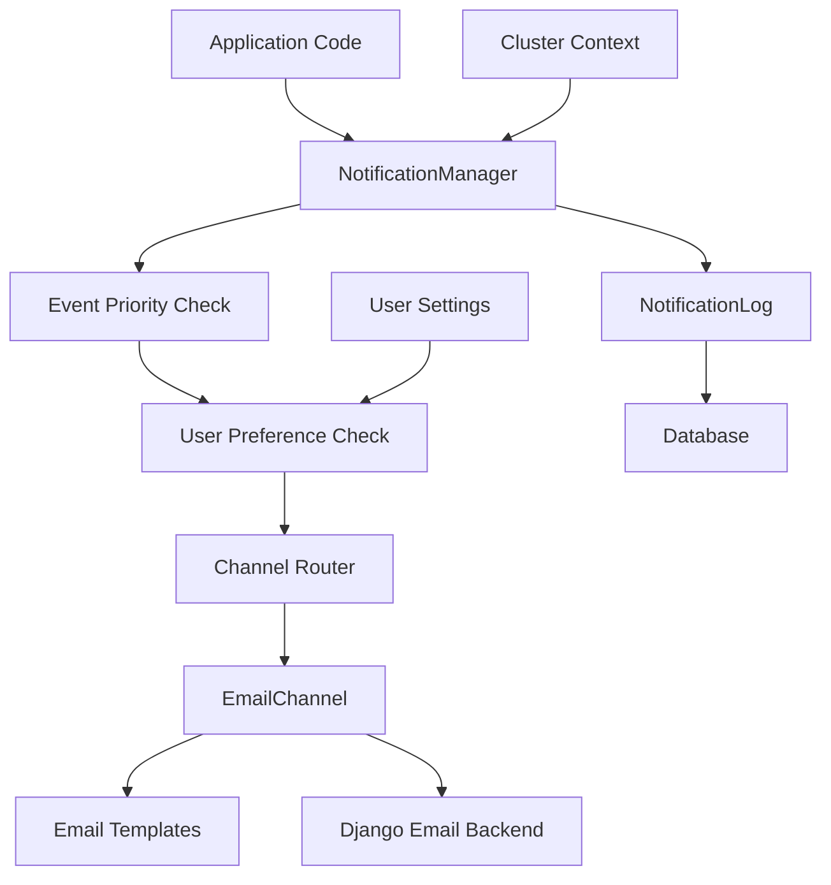

# Notification System Refactor - Design Document

## Overview

This design document outlines the refactoring of ClustR's notification system from a bloated, hardcoded implementation to an ultra-lean, priority-based system. The new system will support email notifications with user preferences, proper estate-scoped multi-tenancy, and easy extensibility for future channels.

## Architecture

### High-Level Architecture



### Core Components

1. **NotificationManager**: Central orchestrator that handles all notification routing
2. **NotificationEvent**: Priority-based enum defining all notification types
3. **EmailChannel**: Clean email implementation using existing email infrastructure
4. **NotificationLog**: Audit trail for all notification attempts
5. **User Preferences**: Leverages existing UserSettings model

## Components and Interfaces

### Event Definition System

```python
class NotificationPriority(IntEnum):
    CRITICAL = 1    # Bypasses user preferences
    HIGH = 2
    MEDIUM = 3
    LOW = 4

class NotificationChannel(Enum):
    EMAIL = "email"
    SMS = "sms"
    WEBSOCKET = "websocket"
    APP = "app"

class NotificationEvents(Enum):
    """Enum for notification event names to prevent typos"""
    EMERGENCY_ALERT = "emergency_alert"
    SECURITY_BREACH = "security_breach"
    VISITOR_ARRIVAL = "visitor_arrival"
    MAINTENANCE_URGENT = "maintenance_urgent"
    PAYMENT_DUE = "payment_due"
    ANNOUNCEMENT_POSTED = "announcement_posted"
    COMMENT_REPLY = "comment_reply"
    NEWSLETTER = "newsletter"

class NotificationEvent:
    """Clean abstraction for notification events"""
    def __init__(self, name: str, priority: NotificationPriority, supported_channels: List[NotificationChannel]):
        self.name = name
        self.priority = priority
        self.supported_channels = supported_channels
    
    @property
    def bypasses_preferences(self):
        return self.priority == NotificationPriority.CRITICAL

# Event registry - clean and extensible, using enum keys
NOTIFICATION_EVENTS = {
    NotificationEvents.EMERGENCY_ALERT: NotificationEvent(
        name=NotificationEvents.EMERGENCY_ALERT.value,
        priority=NotificationPriority.CRITICAL,
        supported_channels=[NotificationChannel.EMAIL, NotificationChannel.SMS, NotificationChannel.WEBSOCKET]
    ),
    NotificationEvents.SECURITY_BREACH: NotificationEvent(
        name=NotificationEvents.SECURITY_BREACH.value,
        priority=NotificationPriority.CRITICAL,
        supported_channels=[NotificationChannel.EMAIL, NotificationChannel.SMS]
    ),
    NotificationEvents.VISITOR_ARRIVAL: NotificationEvent(
        name=NotificationEvents.VISITOR_ARRIVAL.value, 
        priority=NotificationPriority.HIGH,
        supported_channels=[NotificationChannel.EMAIL, NotificationChannel.WEBSOCKET]
    ),
    NotificationEvents.MAINTENANCE_URGENT: NotificationEvent(
        name=NotificationEvents.MAINTENANCE_URGENT.value,
        priority=NotificationPriority.HIGH,
        supported_channels=[NotificationChannel.EMAIL]
    ),
    NotificationEvents.PAYMENT_DUE: NotificationEvent(
        name=NotificationEvents.PAYMENT_DUE.value,
        priority=NotificationPriority.MEDIUM, 
        supported_channels=[NotificationChannel.EMAIL]
    ),
    NotificationEvents.ANNOUNCEMENT_POSTED: NotificationEvent(
        name=NotificationEvents.ANNOUNCEMENT_POSTED.value,
        priority=NotificationPriority.MEDIUM,
        supported_channels=[NotificationChannel.EMAIL]
    ),
    NotificationEvents.COMMENT_REPLY: NotificationEvent(
        name=NotificationEvents.COMMENT_REPLY.value,
        priority=NotificationPriority.LOW,
        supported_channels=[NotificationChannel.EMAIL]
    ),
    NotificationEvents.NEWSLETTER: NotificationEvent(
        name=NotificationEvents.NEWSLETTER.value,
        priority=NotificationPriority.LOW,
        supported_channels=[NotificationChannel.EMAIL]
    ),
}
```

### NotificationManager Interface

```python
class NotificationManager:
    @staticmethod
    def send(
        event_name: NotificationEvents,
        recipients: List[AccountUser],
        cluster: Cluster,
        context: dict[str, Any]
    ) -> bool:
        """
        Send notification to recipients based on event type and user preferences.
        
        Args:
            event_name: Notification event enum (from NotificationEvents)
            recipients: List of users to notify
            cluster: Cluster context for multi-tenancy
            context: Base context data that channels can transform as needed
            
        Returns:
            True if all notifications sent successfully
        """
        # Get event definition
        event = NOTIFICATION_EVENTS.get(event_name)
        if not event:
            logger.error(f"Unknown event: {event_name}")
            return False
        
        # Send via supported channels - each channel handles its own preference filtering and context transformation
        success = True
        for channel in event.supported_channels:
            if channel == NotificationChannel.EMAIL:
                channel_success = EmailChannel().send(event, recipients, cluster, context)
                success = success and channel_success
            # Future channels would be added here
            # elif channel == NotificationChannel.SMS:
            #     channel_success = SMSChannel().send(event, recipients, cluster, context)
            #     success = success and channel_success
        
        return success
    

```

### BaseNotificationChannel Interface

```python
class BaseNotificationChannel:
    def send(
        self,
        event: NotificationEvent,
        recipients: List[AccountUser],
        cluster: Cluster,
        context: dict[str, Any]
    ) -> bool:
        """Send notification via this channel"""
        raise NotImplementedError
    
    def format_message(
        self,
        event: NotificationEvent,
        context: dict[str, Any]
    ) -> dict[str, str]:
        """Format message for this channel"""
        raise NotImplementedError
```

### EmailChannel Implementation

```python
class EmailChannel(BaseNotificationChannel):
    # Map event names to existing email types
    EVENT_EMAIL_TYPE_MAPPING = {
        NotificationEvents.EMERGENCY_ALERT.value: NotificationTypes.EMERGENCY_ALERT,
        NotificationEvents.VISITOR_ARRIVAL.value: NotificationTypes.VISITOR_ARRIVAL,
        NotificationEvents.PAYMENT_DUE.value: NotificationTypes.BILL_REMINDER,
        NotificationEvents.ANNOUNCEMENT_POSTED.value: NotificationTypes.ANNOUNCEMENT,
        # ... map all events to existing email types
    }
    
    def send(self, event: NotificationEvent, recipients: List[AccountUser], cluster: Cluster, context: dict[str, Any]) -> bool:
        """Send email notification using existing infrastructure"""
        try:
            # Map event to email template
            email_type = self.EVENT_EMAIL_TYPE_MAPPING.get(event.name)
            if not email_type:
                logger.error(f"No email template mapping for event: {event.name}")
                return False
            
            # Filter recipients by email preferences (unless critical event)
            if event.bypasses_preferences:
                filtered_recipients = recipients
            else:
                filtered_recipients = self._filter_by_email_preferences(recipients, event.name)
            
            # Filter recipients to only those with email addresses
            email_recipients = [user.email_address for user in filtered_recipients if user.email_address]
            
            if not email_recipients:
                logger.info(f"No valid email recipients for event: {event.name}")
                return True
            
            # Transform context for email-specific needs
            email_context = self._transform_context_for_email(context, event.name)
            
            # Use existing email infrastructure
            sender = AccountEmailSender(
                recipients=email_recipients,
                email_type=email_type,
                context=Context(email_context)
            )
            
            success = sender.send()
            
            # Log notification attempt
            self._log_notification_attempts(event, recipients, cluster, success, context)
            
            return success
            
        except Exception as e:
            logger.error(f"Error sending email notification: {str(e)}")
            self._log_notification_attempts(event, recipients, cluster, False, context, str(e))
            return False
    
    def _filter_by_email_preferences(self, recipients: List[AccountUser], event_name: str) -> List[AccountUser]:
        """Filter recipients based on their email notification preferences"""
        filtered_recipients = []
        
        for user in recipients:
            # Get user settings
            settings, _ = UserSettings.objects.get_or_create(user=user)
            
            # Check if user has email notifications enabled for this event
            if settings.get_notification_preference(event_name, 'EMAIL'):
                filtered_recipients.append(user)
        
        return filtered_recipients
    
    def _transform_context_for_email(self, base_context: dict[str, Any], event_name: str) -> dict[str, Any]:
        """Transform base context for email-specific formatting"""
        email_context = base_context.copy()
        
        # Add email-specific transformations based on event type
        if event_name == NotificationEvents.VISITOR_ARRIVAL.value:
            # Format datetime for email display
            if 'arrival_time' in email_context:
                email_context['formatted_arrival_time'] = email_context['arrival_time'].strftime('%H:%M on %B %d, %Y')
        
        elif event_name == NotificationEvents.PAYMENT_DUE.value:
            # Format currency and dates for email
            if 'amount' in email_context:
                email_context['formatted_amount'] = f"${email_context['amount']:.2f}"
            if 'due_date' in email_context:
                email_context['formatted_due_date'] = email_context['due_date'].strftime('%B %d, %Y')
        
        return email_context
    
    def _log_notification_attempts(self, event, recipients, cluster, success, context, error_message=None):
        """Log notification attempts for audit trail"""
        for recipient in recipients:
            NotificationLog.objects.create(
                cluster=cluster,
                event=event.name,
                recipient=recipient,
                channel='EMAIL',
                success=success,
                error_message=error_message,
                context_data=context
            )
```

## Data Models

### NotificationLog Model

```python
class NotificationLog(UUIDPrimaryKey, ObjectHistoryTracker):
    """Audit log for all notification attempts"""
    
    cluster = models.ForeignKey(
        'common.Cluster',
        on_delete=models.CASCADE,
        related_name='notification_logs'
    )
    
    event = models.CharField(
        max_length=50,
        help_text="Name of the notification event"
    )
    
    recipient = models.ForeignKey(
        'accounts.AccountUser',
        on_delete=models.CASCADE,
        related_name='received_notifications'
    )
    
    channel = models.CharField(
        max_length=20,
        default='EMAIL'
    )
    
    success = models.BooleanField(default=False)
    error_message = models.TextField(blank=True, null=True)
    
    context_data = models.JSONField(default=dict)
    
    sent_at = models.DateTimeField(auto_now_add=True)
```

## Usage Examples

### 1. Simple Notification Sending
```python
# In your application code - clean and simple with enum safety
NotificationManager.send(
    event_name=NotificationEvents.VISITOR_ARRIVAL,
    recipients=[user1, user2],
    cluster=request.user.cluster,
    context={
        'visitor_name': 'John Doe', 
        'unit': 'A101',
        'arrival_time': datetime.now()
    }
)
```

### 2. Emergency Alert (Bypasses Preferences)
```python
# Critical events bypass user preferences
NotificationManager.send(
    event_name=NotificationEvents.EMERGENCY_ALERT,
    recipients=all_cluster_users,
    cluster=cluster,
    context={
        'alert_message': 'Fire alarm activated', 
        'location': 'Building A',
        'severity': 'HIGH'
    }
)
```

### 3. Adding New Events
```python
# First, add to enum
class NotificationEvents(Enum):
    # ... existing events
    MAINTENANCE_COMPLETE = "maintenance_complete"

# Then add to registry
NOTIFICATION_EVENTS[NotificationEvents.MAINTENANCE_COMPLETE] = NotificationEvent(
    name=NotificationEvents.MAINTENANCE_COMPLETE.value,
    priority=NotificationPriority.MEDIUM,
    supported_channels=[NotificationChannel.EMAIL, NotificationChannel.APP]
)

# Then use it immediately with type safety
NotificationManager.send(
    event_name=NotificationEvents.MAINTENANCE_COMPLETE,
    recipients=[resident],
    cluster=cluster,
    context={
        'work_order': '12345', 
        'completion_date': datetime.now(),
        'technician': 'John Smith'
    }
)
```

### 4. Replacing Existing Notification Calls
```python
# Old way (from existing codebase)
NotificationManager.send_visitor_arrival_notification(
    user_email=user.email_address,
    visitor_name='John Doe',
    access_code='ABC123'
)

# New way with enum safety and context transformation
NotificationManager.send(
    event_name=NotificationEvents.VISITOR_ARRIVAL,
    recipients=[user],
    cluster=user.cluster,
    context={
        'visitor_name': 'John Doe', 
        'access_code': 'ABC123',
        'arrival_time': datetime.now()
    }
)
# EmailChannel will transform this to include 'formatted_arrival_time' for email templates
```

### 5. Context Transformation Example
```python
# Base context provided to manager
base_context = {
    'amount': 150.00,
    'due_date': datetime(2024, 2, 15),
    'bill_number': 'BILL-001'
}

# EmailChannel transforms it to:
email_context = {
    'amount': 150.00,
    'due_date': datetime(2024, 2, 15),
    'bill_number': 'BILL-001',
    'formatted_amount': '$150.00',  # Added by EmailChannel
    'formatted_due_date': 'February 15, 2024'  # Added by EmailChannel
}

# SMSChannel might transform it to:
sms_context = {
    'amount': '$150',  # Shortened for SMS
    'due': 'Feb 15',   # Abbreviated for SMS
    'bill': 'BILL-001'
}
```

## Error Handling

### Error Handling Strategy

1. **Graceful Degradation**: If email sending fails, log error but don't crash
2. **Retry Logic**: Not implemented initially (keep it lean)
3. **Error Logging**: All failures logged to NotificationLog with error details
4. **Fallback**: No fallback channels initially (email-only system)

### Error Types

- **Template Not Found**: Log error, skip notification
- **Email Send Failure**: Log error with SMTP details
- **Invalid Recipients**: Filter out invalid users, continue with valid ones
- **Missing Context**: Log warning, send with available context

## Testing Strategy

### Unit Tests

1. **NotificationEvent Tests**
   - Priority level calculation
   - Preference bypass logic
   - Event categorization

2. **NotificationManager Tests**
   - Event routing logic
   - User preference filtering
   - Cluster scoping
   - Error handling

3. **EmailChannel Tests**
   - Template mapping
   - Message formatting
   - Email sending integration
   - Error scenarios

### Integration Tests

1. **End-to-End Notification Flow**
   - Send notification with valid users
   - Verify email sent and logged
   - Test preference filtering

2. **Multi-Tenant Isolation**
   - Verify cluster scoping works
   - Test cross-cluster isolation

3. **User Preference Integration**
   - Test preference checking
   - Verify critical events bypass preferences

### Test Data Setup

```python
# Test fixtures for different scenarios
@pytest.fixture
def test_cluster():
    return Cluster.objects.create(name="Test Estate")

@pytest.fixture
def test_users_with_preferences():
    # Create users with various notification preferences
    
@pytest.fixture
def notification_contexts():
    # Various context data for different event types
```

## Implementation Plan

### Phase 1: Core Infrastructure
1. Create NotificationEvent enum
2. Implement NotificationManager
3. Create NotificationLog model
4. Set up basic email channel

### Phase 2: Integration
1. Map existing email types to events
2. Integrate with UserSettings preferences
3. Add cluster scoping
4. Implement error handling

### Phase 3: Replacement
1. Replace all existing notification calls
2. Remove old notification_utils.py
3. Update all references throughout codebase
4. Clean up unused email types

### Phase 4: Testing & Validation
1. Comprehensive test suite
2. Manual testing of all notification flows
3. Performance validation
4. Documentation updates

## Migration Strategy

### Database Migrations
- Add NotificationLog model
- No changes to existing UserSettings (reuse existing structure)
- No changes to Cluster model

### Code Migration
1. **Identify All Notification Calls**: Search codebase for existing notification methods
2. **Create Mapping**: Map each old method to new NotificationEvent
3. **Replace Incrementally**: Update calls one module at a time
4. **Remove Old Code**: Delete notification_utils.py after all references updated

### Rollback Plan
- Keep old notification_utils.py until migration complete
- Feature flag to switch between old/new systems during testing
- Database rollback for NotificationLog table if needed

## Performance Considerations

### Optimization Strategies
1. **Bulk Email Sending**: Use existing AccountEmailSender bulk capabilities
2. **Preference Caching**: Cache user preferences for frequently accessed users
3. **Database Indexing**: Proper indexes on NotificationLog for queries
4. **Async Processing**: Not implemented initially (keep lean), but architecture supports it

### Scalability
- Current design handles up to 1000 users per cluster efficiently
- Email sending limited by Django's email backend configuration
- NotificationLog table will grow over time - consider archiving strategy

### Monitoring
- Log notification success/failure rates
- Monitor email delivery times
- Track user preference changes
- Alert on high failure rates

## Security Considerations

### Data Protection
- Cluster isolation enforced at manager level
- User preferences respected (except critical events)
- Context data sanitized before logging
- Email content follows existing security practices

### Access Control
- Only authenticated users can trigger notifications
- Cluster membership verified before sending
- Admin-only events restricted to admin users
- Audit trail for all notification attempts

### Privacy
- Minimal context data logged (no sensitive information)
- User preferences honored for non-critical events
- Email addresses not exposed in logs
- GDPR compliance through existing user data handling

## Alternative Design Considerations

### Self-Contained Enum Approach (Under Consideration)

An alternative approach would be to merge the enum and event properties into a single self-contained enum:

```python
class NotificationEvents(Enum):
    def __new__(cls, value, priority, supported_channels):
        obj = object.__new__(cls)
        obj._value_ = value
        obj.priority = priority
        obj.supported_channels = supported_channels
        return obj
    
    @property
    def bypasses_preferences(self):
        return self.priority == NotificationPriority.CRITICAL
    
    # Define events with their properties inline
    EMERGENCY_ALERT = ("emergency_alert", NotificationPriority.CRITICAL, [NotificationChannel.EMAIL, NotificationChannel.SMS])
    VISITOR_ARRIVAL = ("visitor_arrival", NotificationPriority.HIGH, [NotificationChannel.EMAIL, NotificationChannel.WEBSOCKET])
    PAYMENT_DUE = ("payment_due", NotificationPriority.MEDIUM, [NotificationChannel.EMAIL])
```

**Pros:**
- Eliminates separate registry
- Self-contained event definitions
- No sync issues between enum and registry

**Cons:**
- Hacky enum usage that's not very Pythonic
- Less readable event definitions
- Harder to extend or modify event properties
- May confuse other developers

**Decision:** Stick with the current cleaner separation of concerns approach for better maintainability and readability.